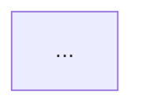

# 图谱系

S4 画图前读。

目录：[图的密度](#图的密度) · [图型怎么选](#图型怎么选) · [画得有信息量](#画得有信息量) · [语法陷阱](#语法陷阱) · [渲染](#渲染)

## 图的密度

早期版本写的是「默认只画两张，多了会稀释注意力」。实测证明这条是错的：对照的深度拆解文档二十余张图，读起来比两张图的版本清楚得多，因为图承载的是结构本身，不是配图。

判断标准不是数量，是这一段文字读者需不需要在脑子里自己画一张图。需要就补上。具体三种情况必配图：

1. **有层次**：分层架构、目录结构、抽象层级
2. **有流转**：一条数据或一次请求经过多个模块
3. **有并列对照**：多个方案、多个阶段、多种状态

反过来，纯粹的清单、单点说明、已经能用表格讲清的内容不要配图。图和表格重复表达同一件事时删掉图。

同一节里连着两张图讲同一件事，说明其中一张是多余的，或者这一节该拆成两节。

## 图型怎么选

| 图型 | 画什么 | 什么时候用 |
| --- | --- | --- |
| `graph TB` / `flowchart TB` | 分层架构，上层调下层 | 有明确层次关系时。用 `subgraph` 圈层，层名写在 subgraph 上 |
| `graph LR` | 横向流转、状态迁移、映射关系 | 从左到右的过程，或两组东西的对应关系 |
| `graph TD` | 树形分解、启动叠加、决策分支 | 一个东西展开成多个 |
| `sequenceDiagram` | 一次完整调用的时序 | 主链路必配。带 `alt` / `Note` 表达分支和要点 |
| `stateDiagram-v2` | 状态机 | 项目有明确的状态流转时 |
| `erDiagram` | 数据模型 | 有数据库且实体关系是理解重点时 |
| `classDiagram` | 类继承与实现 | 强 OO 项目，且继承关系承载了设计意图 |
| `mindmap` | 概念归类 | 设计理念提纯那节，把散落的原则归成几组 |

主链路时序图是所有图里最重要的一张。架构图是静态的，只告诉人有哪些盒子；时序图带人跟着一个真实请求从入口走到出口，建立整体直觉靠的是这个。

## 画得有信息量

**边要标注关系类型，不要只画箭头。** 只有箭头的图信息量很低，读者不知道 A 到 B 是同步调用、发消息、写共享存储还是定时触发。写成 `A -->|"cron 串行"| B`。

**节点是模块不是文件。** 一个模块由三个文件实现就画一个节点，文件名写进节点说明或正文，不要把文件树搬进图里。

**可切换或可选的路径用虚线。** `-.->` 表示降级路径、可替换实现、条件触发。实线留给主路径。

**subgraph 的标题要说清这一层解决什么问题**，不要只写层号。`subgraph L2["能力接缝层，全部可替换"]` 比 `subgraph L2["第二层"]` 有用。

**时序图用 `Note over` 标出关键约束**，比如某一步是幂等的、某一步会落盘、某一步之后可以安全中断。这些是读代码才知道的信息，正好用图承载。

**图配一段话或一张表。** 图给结构，文字给结构之外的东西——每层解决什么问题、关键实体是什么。两者互补，不要让图独自承担全部解释。

## 语法陷阱

节点文本里出现括号、方括号、花括号、冒号、中文引号会解析失败。一律用双引号包起来：

```
A["处理请求 (异步)"]
B["超时: 30s"]
```

其余踩过的点：

- 节点内换行用 `<br/>`，不是 `\n`
- `graph LR` 里边的标签也要引号：`A -->|"写文件"| B`
- 多源连边 `A & B & C --> D` 有效，可以少写几行
- sequenceDiagram 的 participant 别名带引号有效：`participant SH as "ops/fetch_all.sh"`，斜杠和点都能正常显示
- 中文节点 id 能用但容易和标签混淆，id 用英文短名，中文放标签里

## 渲染

每个 mermaid 块前加一行标题注释，脚本靠它命名文件：

```markdown
<!-- fig: 模块依赖全景 -->

```

然后跑：

```bash
python3 scripts/render_diagrams.py <文档.md>
```

脚本做三件事：抠出所有 mermaid 块、渲染成 SVG 存到文档同级 `图/` 目录、在代码块前插入图片引用。幂等，重复跑只刷新 SVG 不重复插引用。

留代码块的理由是改图时改代码重跑就行，不用重画。落 SVG 文件的理由是 mermaid 代码块只在支持渲染的环境里是图，贴进飞书就是一坨文本。

渲染失败必须修，不能跳过。失败信息里会指出是第几块，多数情况是节点文本没加双引号。

首次运行会 `npx` 拉包，国内直连大概率 ECONNRESET。脚本自己探测本地代理端口并重试一次，仍失败就手动带 `https_proxy` 重跑。
